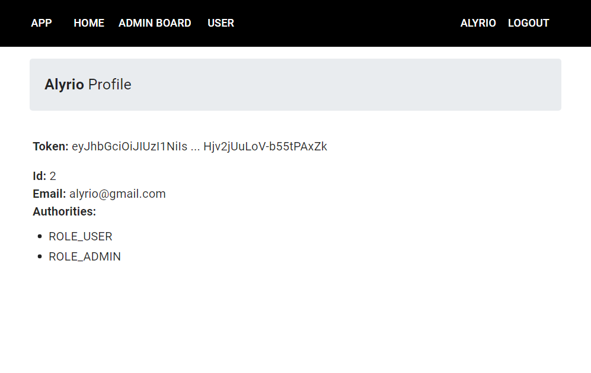

# Login e registro com React Typescript

O projeto é um aplicativo de Login e Registro desenvolvido em React com Typescript, utilizando as bibliotecas React Router, Axios e Material UI. O objetivo é fornecer uma interface amigável para os usuários fazerem o login em suas contas ou se registrarem para criar uma nova conta.



Recursos:

 - Fluxo de autenticação JWT para inscrição e login do usuário.
 - Estrutura do projeto para autenticação React Typescript com React Router & Axios.
 - Criando componentes React com validação de formulário usando react-hook-form e Yup.
 - React Typescript Components para acessar recursos protegidos (autorização).
 - Barra de navegação dinâmica no aplicativo.

## Visão geral

 - Existem páginas de login/logout e de inscrição.
 - Os dados do formulário serão validados pelo front-end antes de serem enviados ao back-end.
 - Dependendo das funções do usuário (admin, moderador, usuário), a barra de navegação muda seus itens automaticamente.

## Execução e implementação

Para executar o projeto, siga as etapas abaixo:

Certifique-se de ter o Node.js instalado em sua máquina.

Abra o terminal e navegue até a pasta raiz do projeto.

Execute o seguinte comando para instalar todas as dependências do projeto:

```cmd
npm install
```

Execute o comando a seguir para iniciar o servidor de desenvolvimento:

```cmd
npm run dev
```

O Vite irá iniciar o servidor de desenvolvimento e abrirá automaticamente o seu navegador padrão com o projeto em execução. 

Agora você pode navegar para as rotas /login e /register para testar o formulário de login e registro.

Para implementar o back-end segue o link: [Back End Login](https://github.com/rafael-pc/node-jwt-authentication-postgresql)

Certifique-se de que o backend da aplicação também esteja sendo executado corretamente e que as rotas da API estejam configuradas corretamente para se comunicarem com o frontend.

Lembrando que essas são apenas instruções básicas para executar o projeto. Dependendo das configurações específicas do seu ambiente de desenvolvimento e do projeto em si, pode ser necessário fazer ajustes adicionais.
